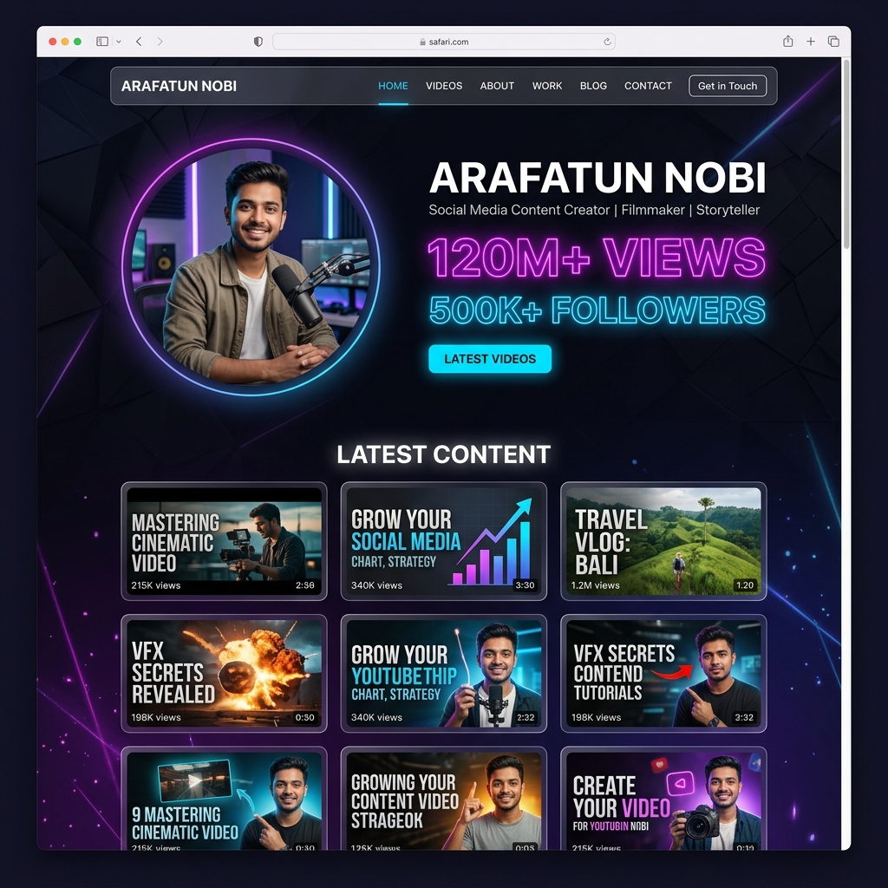

# Arafatun Nobi — Content Creator Portfolio



A premium, high-impact personal portfolio website designed for **Arafatun Nobi**, a prominent social media content creator known for his **"Fun of USA"** channel, viral pranks, and active presence in the Sonic community. This project serves as a cinematic hub for his creative works, reaching millions of viewers worldwide.

---

## 🚀 Live Demo
**[View Live Site]https://arafatunnobi.netlify.app/)** 

---

## 🛠 Technology Stack

The project is built using a modern, performance-first tech stack:

- **Core**: [React 19](https://reactjs.org/) & [Vite](https://vitejs.dev/)
- **Styling**: Vanilla CSS with HSL color tokens for a deep, premium aesthetic.
- **Animations**: [Framer Motion](https://www.framer.com/motion/) for fluid, cinematic transitions.
- **Icons**: [Lucide React](https://lucide.dev/) + Custom SVG brand icons.
- **Routing**: [React Router v7](https://reactrouter.com/) for seamless navigation.

---

## ✨ Core Features

- **Dynamic Hero Section**: High-impact branding featuring real-time creator stats (Views, Followers, Stories).
- **Creative Archive**: An interactive, category-based video library allowing viewers to filter through Pranks, Comedy, and Community content.
- **Visionary Narratives**: A dedicated "About" page that tells the story behind the "Fun of USA" brand.
- **Collaboration Gateway**: A custom contact flow that redirects directly to Gmail with pre-filled professional inquiry details.
- **Glassmorphism UI**: A consistent, modern design system using blurred backgrounds and vibrant gradients.

---

## 📦 Dependencies

```json
{
  "dependencies": {
    "framer-motion": "^12.38.0",
    "lucide-react": "^1.8.0",
    "react": "^19.2.4",
    "react-dom": "^19.2.4",
    "react-router-dom": "^7.14.0"
  }
}
```

---

## ⚙️ Local Setup

Follow these steps to get the project running on your local machine:

1. **Clone the repository:**
   ```bash
   git clone https://github.com/arafatven1/web.git
   ```

2. **Navigate to the project directory:**
   ```bash
   cd web
   ```

3. **Install dependencies:**
   ```bash
   npm install
   ```

4. **Start the development server:**
   ```bash
   npm run dev
   ```

5. **Open in Browser:**
   Visit `http://localhost:5173` to see the site in action.

---

Managed with ❤️ by ahadun nobi
